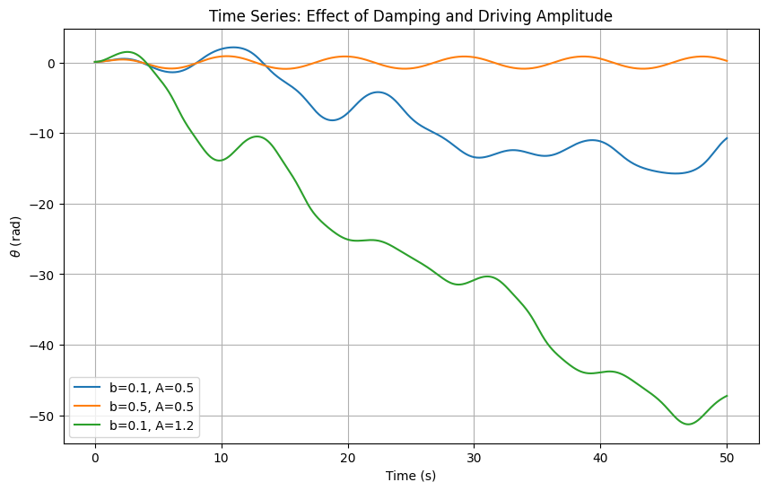
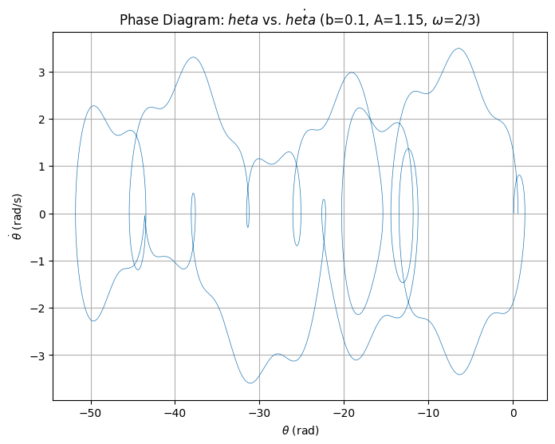
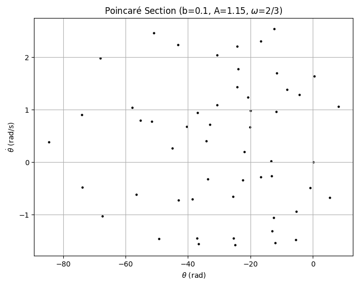

# Problem 2: Forced Damped Pendulum

## 1. Theoretical Foundation
The forced damped pendulum is a nonlinear system governed by:
$$
\frac{d^2\theta}{dt^2} + b \frac{d\theta}{dt} + \frac{g}{L} \sin\theta = A \cos(\omega t)
$$
For small angles, $\sin\theta \approx \theta$, yielding a linear equation:
$$
\frac{d^2\theta}{dt^2} + b \frac{d\theta}{dt} + \omega_0^2 \theta = A \cos(\omega t)
$$
where $\omega_0 = \sqrt{g/L}$. Solutions include transient decay and a steady-state response:
$$
\theta_p(t) = D \cos(\omega t - \phi), \quad D = \frac{A}{\sqrt{(\omega_0^2 - \omega^2)^2 + (b \omega)^2}}
$$
Resonance occurs when $\omega \approx \omega_0$, maximizing amplitude.

## 2. System Dynamics
- **Damping $(b)$**: Higher $b$ reduces oscillation amplitude and shifts resonance.
- **Driving Amplitude $(A)$**: Larger $A$ increases response, introducing nonlinear effects.
- **Driving Frequency $(\omega)$**: Controls synchronization and energy transfer.
- **Chaos**: Increasing $A$ can induce period doubling and chaotic behavior.

## 3. Applications
- **Energy Harvesting**: Piezoelectric devices optimize energy capture by tuning $\omega_0$.
- **Bridges**: Wind-induced oscillations (e.g., Tacoma Narrows) align with resonance behavior.
- **Oscillating Circuits**: Analogous to RLC circuits with $\omega_0$ and damping.

## 4. Implementation of the Forced Damped Pendulum Simulation

This section outlines the computational framework to simulate the forced damped pendulum, governed by:

$$
\frac{d^2\theta}{dt^2} + b \frac{d\theta}{dt} + \frac{g}{L} \sin\theta = A \cos(\omega t)
$$

We develop a model using Python, incorporating parameters—damping coefficient $(b)$, driving amplitude $(A)$, driving frequency $(\omega)$, and initial conditions $(\theta_0, \dot{\theta}_0)$ to explore the system’s behavior. Separate visualizations highlight time evolution, phase portraits, and Poincaré sections, revealing periodic, quasiperiodic, and chaotic regimes.

### 4.1 Computational Model Setup

The nonlinear second-order ODE is converted to a system of first-order ODEs:

$$
\frac{d\theta}{dt} = v
$$

$$
\frac{dv}{dt} = -b v - \frac{g}{L} \sin\theta + A \cos(\omega t)
$$

We use `scipy.integrate.odeint` for numerical integration, with $g/L = 1$ (normalized natural frequency $\omega_0 = 1$) for simplicity.

---

### 4.2 Time Series: Effect of Damping and Driving Amplitude

This script simulates $\theta(t)$ under varying $b$ and $A$, illustrating damping’s stabilizing effect and amplitude’s role in driving oscillations.

```python
import numpy as np
import matplotlib.pyplot as plt
from scipy.integrate import odeint

# Define the system
def pendulum(state, t, b, A, omega):
    theta, v = state
    dtheta_dt = v
    dv_dt = -b * v - np.sin(theta) + A * np.cos(omega * t)
    return [dtheta_dt, dv_dt]

# Parameters
t = np.linspace(0, 50, 1000)  # Time array
omega = 2/3  # Driving frequency
initial_conditions = [0.1, 0]  # [theta0, v0]

# Cases to compare
params = [(0.1, 0.5, "b=0.1, A=0.5"), (0.5, 0.5, "b=0.5, A=0.5"), (0.1, 1.2, "b=0.1, A=1.2")]

# Simulate and plot
plt.figure(figsize=(10, 6))
for b, A, label in params:
    sol = odeint(pendulum, initial_conditions, t, args=(b, A, omega))
    theta = sol[:, 0]
    plt.plot(t, theta, label=label)

plt.xlabel("Time (s)")
plt.ylabel(r"$\theta$ (rad)")
plt.title("Time Series: Effect of Damping and Driving Amplitude")
plt.legend()
plt.grid(True)
plt.show()
```

**Output**: A plot comparing $\theta(t)$ for low damping/low amplitude (periodic), high damping (damped periodic), and low damping/high amplitude (approaching chaos).



---

### 4.3 Phase Diagram: $\theta$ vs. $\dot{\theta}$

This script generates a phase portrait, showing the relationship between $\theta$ and $v = \dot{\theta}$, revealing attractors and dynamic regimes.

```python
import numpy as np
import matplotlib.pyplot as plt
from scipy.integrate import odeint

# System definition (same as above)
def pendulum(state, t, b, A, omega):
    theta, v = state
    dtheta_dt = v
    dv_dt = -b * v - np.sin(theta) + A * np.cos(omega * t)
    return [dtheta_dt, dv_dt]

# Parameters
t = np.linspace(0, 100, 2000)  # Longer time for steady state
b = 0.1  # Damping
A = 1.15  # Driving amplitude (near chaotic threshold)
omega = 2/3  # Driving frequency
initial_conditions = [0.1, 0]

# Solve
sol = odeint(pendulum, initial_conditions, t, args=(b, A, omega))
theta = sol[:, 0]
v = sol[:, 1]

# Plot phase diagram
plt.figure(figsize=(8, 6))
plt.plot(theta, v, lw=0.5)
plt.xlabel(r"$\theta$ (rad)")
plt.ylabel(r"$\dot{\theta}$ (rad/s)")
plt.title("Phase Diagram: $\theta$ vs. $\dot{\theta}$ (b=0.1, A=1.15, $\omega$=2/3)")
plt.grid(True)
plt.show()
```

**Output**: A phase portrait showing a complex trajectory, potentially a strange attractor, indicating chaotic behavior for $A = 1.15$.



---

### 4.4 Poincaré Section: Transition to Chaos

This script constructs a Poincaré section by sampling $\theta$ and $\dot{\theta}$ at intervals of the driving period $(T = 2\pi/\omega)$, highlighting the transition from regular to chaotic motion.

```python
import numpy as np
import matplotlib.pyplot as plt
from scipy.integrate import odeint

# System definition (same as above)
def pendulum(state, t, b, A, omega):
    theta, v = state
    dtheta_dt = v
    dv_dt = -b * v - np.sin(theta) + A * np.cos(omega * t)
    return [dtheta_dt, dv_dt]

# Parameters
omega = 2/3
T = 2 * np.pi / omega  # Driving period
t = np.linspace(0, 500, 10000)  # Long time for convergence
b = 0.1
A = 1.15  # Chaotic regime
initial_conditions = [0.1, 0]

# Solve
sol = odeint(pendulum, initial_conditions, t, args=(b, A, omega))
theta = sol[:, 0]
v = sol[:, 1]

# Poincaré section: sample at t = n * T
section_times = np.arange(0, 500, T)
section_indices = [np.argmin(np.abs(t - st)) for st in section_times]
theta_section = theta[section_indices]
v_section = v[section_indices]

# Plot
plt.figure(figsize=(8, 6))
plt.scatter(theta_section, v_section, s=5, c='black')
plt.xlabel(r"$\theta$ (rad)")
plt.ylabel(r"$\dot{\theta}$ (rad/s)")
plt.title("Poincaré Section (b=0.1, A=1.15, $\omega$=2/3)")
plt.grid(True)
plt.show()
```

**Output**: A scatter plot showing a fractal-like structure, characteristic of chaos, with points filling a region rather than forming a closed curve (periodic) or finite set (quasiperiodic).



## 5. Colab
[Souce Code](https://colab.research.google.com/drive/15aGFlb5NE9oBT899TNwH6I6dkH2gGlYj?usp=sharing)